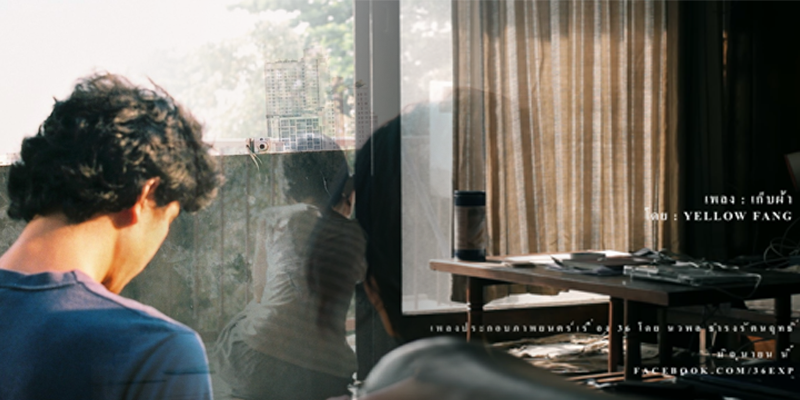

เนื่องจากเมื่อวานได้ไปทำการใช้สิทธิ์ของสมาชิกโรงภาพยนตร์ House Samyan (House Samyan) ซึ่งเป็นโปรที่ดูหนังฟรี แล้วพอดีมีเรื่องที่เราอยากดู คือ เรื่อง 36 ด้วยการเฝ้ารอมาหลายปีมาก Mary is Happy จนถึงหนังของพี่เต๋อ ที่ได้ดูล่าสุดคือ Die tomorrow เมื่อปลายปีธันวา 61 ตอนนั้นเป็นครั้งแรกที่ได้รู้จักกับ โรงหนัง HouseRCA โรงภาพยนต์ Indy ที่ตั้งอยู่ใกล้ๆกับ RCA ที่เป็นย่านบันเทิงที่ดังที่สุด ซึ่ง เดินทางลำบากมาก 555 เอาจริงๆ โคตรคิดถึง HouseRCA เลยอ่ะ คิดถึงบรรยากาศตอนเดินกลับบ้าน คิดถึงข้าวไข่เจียว ใต้โรงหนัง ซึ่ง เป็นการมาเที่ยวคนเดียว โดดเดี่ยวเป็นครั้งแรกได้เลยมั้ง  ถึงแม้ว่าตอนนี้จะย้ายมาเป็น House Samyan แล้วก็ตาม ก็ยังคงคิดถึงความเป็น House RCA อยู่

## กลับมาถึงเรื่องหนังดีกว่า
หนังเรื่องนี้เดินเรื่องตั้งแต่เรื่องที่ 1 - 36 เหมือนฟิล์มหนึ่งอันที่มี 36 ภาพ ใช้ข้อความสั้นๆเป็นตัวดำเนินเรื่องตามความรู้สึกของคนดู ไปเรื่อยๆ ไปเรื่อยๆ 
โดยมีนางเอกที่เป็นนักหาโลเคชั่น ชื่อทราย และมีพระเอกที่เป็น Art director ชื่ออุ้ม ในปี 2008 ทั้งคู่ต้องทำงานด้วยกันตลอด ทรายเป็นคนชอบรัวชัตเตอร์มากกับกล้องดิจิตอลตัวเก่งของเธอ ส่วนอุ้ม ก็มีกล้องที่เป็นกล้องฟิล์ม ซึ่งจะถ่ายทีก็ต้องคิดที และนิสัยส่วนตัวของอุ้มคือไม่ชอบโดนถ่ายรูป เมื่อผ่านไป ปีนึง โดยทั้งคู่ไม่ได้ทำงานด้วยกันแล้ว อุ้มลาออกไป ส่วนทรายก็ยังคงทำหน้าที่หา Location เหมือนเดิม โดยที่ความทรงจำดีๆที่เขาทั้งคู่ทำงานด้วยกันก็ยังไม่จางหายไปไหน และก็มีเพียงรูปถ่ายตอนที่เขาทำงานด้วยกันเท่านั้นที่ยังคงอยู่ แต่แล้วก็มาพบว่า Harddisk ของทรายดันพังซะงั้น อยู่ดีๆก็เสียบไม่เข้า ทรายพยายามเสียบเข้าเสียบออกหลายครั้งก็ไม่เข้าซะที เลยติดต่อกับเพื่อนทราย โดยเพื่อนทรายก็แนะนำให้ติดต่อกับเพื่อนอีกคนที่จะช่วยกู้คืนความทรงจำระหว่างอุ้มและเธอได้ สรุปแล้วก็ไม่สามารถกู้คืนได้มาทั้งหมด โดยภาพที่กลับมาก็หายไปครึ่งนึงซะด้วย สุดท้ายก็ไม่เหลือความทรงจำที่เป็นชิ้นเป็นอัน เหลือแต่ความทรงจำที่เป้นจิตวิญญาณอันน่าประทับใจเท่านั้น

### สิ่งที่ชอบ
* ชอบนางเอกมากอ่ะ ส่วนพระเอกไม่เห็นหน้า แต่สัมผัสได้ว่า เค้าทำงานด้วยกันได้อบอุ่นมาก 
* ชอบด้วยความที่หนังมัน 5 ปีแล้ว ได้ย้อนกลับไปเห็นอะไรเก่าๆ อย่าง Notebook ยุคหนาเตอะ มี CD Drive ได้เห็น ฮาร์ดดิสก์ ก้อนใหญ่ ได้เห็น Core I5 Gen แรกๆ 
* สีภาพของหนังสวยมาก
* พี่เต๋อก็คือพี่เต๋ออ่ะ ทำหนังแบบนี้ก็คือหนังพี่เต๋อ 555 ตรงใจเราสุดๆ 
* เป็นหนังรักที่ touch ใจเรามาก
* ชอบการนั่งดูตัวละครดำเนินไปเรื่อยๆ ปล่อยใจไปตามเค้า
* ฟังเพลงเก็บผ้า ของ Yellow Fang รัวๆ  

จะตามดูหนังของนวพลไปเรื่อยๆเลย 
นอนหลับได้อย่างสมบูรณ์แล้ว : )

