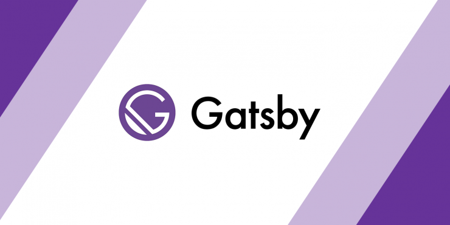

#### Hi สวัสดีทุกคน ~
อย่าเรียกว่าเล่าละกัน ให้เรียกว่าอยากบ่น 5555 ยินดีกับตัวเองที่เข้าสู่บ้านหลังใหม่อย่างสมบูรณ์แบบ จริงๆมันเป็นความเท่อย่างนึงนะไม่รู้สิ เราใช้บน Medium มา 3 ปี มีความรู้สึกว่าทำไมเราไม่มีเป็นของตัวเองบ้าง ซึ่งเอาจริงๆเคยคิดจะทำหลายรอบละ ตั้งแต่ จดโดเมน เช่าโฮสต์ php ยุคก่อนโน้น แล้วลง WordPress เมื่อสมัย ปี 1 

ทั้งนี้ทั้งนั้นกว่าจะมาถึงจุดๆนี้ได้นี่ เรียกได้ว่าลองผิดลองถูกมาหลายครั้ง จนรู้สึกว่าตัวเองมาผิดทาง เพราะไม่เห็น gatsby blog generator โง่มาก T T

จริงๆการที่ย้ายมาใช้ gatsby นี่ยุ่งยากเหมือนกันนะ เพราะถ้าจะเขียนบล็อคทีนี่ก็ต้องใช้ Markdown ล้วนๆ ไม่เหมือนตอนอยู่ Medium มันสะดวกกว่า แถมจัด Format ได้ดูดีกว่าเยอะเลยย 555 ไม่เป็นไรค่อยๆศึกษากันไปเนอะ

เอาเถอะ เรื่องมันมีอยู่ว่าเรามีโอกาสได้ไปงาน Gatsby Developer Meetup #1 

เราก็เข้าไปฟังกับ ฝน พี่กัน และก็ พี่ไอซ์ ที่เราไปด้วยกัน ซึ่งในภาพรวมของงาน ส่วนใหญ่ พี่ๆ Speaker ก็จะนำประสบการณ์การใช้งาน Gatsby มาเล่าให้ฟัง ว่ามันเป็นลักษณะไหน และก็มีการเล่าสู่กันฟังว่า กว่าจะย้าย Blog ออกมาจาก Wordpress หรือ อื่นๆ ยากลำบากขนาดไหน 

ตอนฟัง Part แรกๆของพี่ Riffy เราก็หลับๆตื่นๆนะ แต่เรามาตื่น Part หลังก็คือ พี่ Arnondora เล่าเกี่ยวกับการย้ายบ้านจาก Wordpress ไป gatsby ตอนแรกก็ไม่ get concept หรอก เพราะยัง งงๆว่า gatsby มันจะไป Link กับ Google Drive ยังไง 

สุดท้ายมาจบที่ Inbox หลังจากกลับมาจากงาน ถามพี่ Arnondora ซะเลย เพราะจะถามที่งานแล้วแต่ลืมคำถาม กรรมมากๆ T T

วาร์ปเพจ : https://www.facebook.com/arnondora/

ครั้งแรกตื่นเต้นมากเลยเว้ย คือ กลัวโดนพี่ด่า ไม่ใช่อะไรหรอก คือเป็นคนเข้าใจยากไง แล้วพี่เค้าจะหัวร้อนมั้ย สรุปพี่อธิบายยาวมาก แล้วเหมือนจะเข้าใจก็ยังไม่เข้าใจอีก จุดๆนั้นจะทักไปอีกดีมั้ย 5555 

สุดท้ายก็ทักไปเพราะด้วยความที่เราอยากรู้จริงๆ พี่ก็อธิบายใจเย็นมา ขอบคุณพี่มากจริงๆ สุดท้ายก็บังเกิดเป็น Topspin.xyz Beta Version พยายามจะลองทำให้มันเหมือน Medium Cloning มากที่สุด โดยใช้ เว็บนี้แหละเป็นกรณีศึกษาในการพัฒนามันไปเรื่อยๆ 

## สิ่งที่ได้เรียนรู้จากการย้ายมา
1. ได้เรียนรู้ Gatsby.js ว่ามันสะดวกอะไรเบอร์นี้
2. ได้เรียนรู้ graphql พื้นฐานว่ามันเป็นประมาณไหน
3. ฝึก Soft Skills ในการสื่อสารหรือบอกความต้องการแก่ผู้ที่ต้องการช่วยเหลือ 
4. ได้เรียนรู้การเขียน Markdown 
5. ได้เรียนรู้การ transfer จาก medium มาเป็น Markdown ใช้ Lib จาก NodeJS

สุดท้ายนี้ Entry นี้เป็นการบ่นอย่างเดียว
และก็มาขอบคุณพี่ Arnondora ที่ให้ความกรุณาอย่างสูง ช่วยเหลือจนสำเร็จ ขอบคุณพี่ Riffy ที่จัดงานนี้ขึ้นกระตุ้นให้เราพัฒนาตัวเองให้ดีขึ้นไปอีก

บายจ้า :smile:
