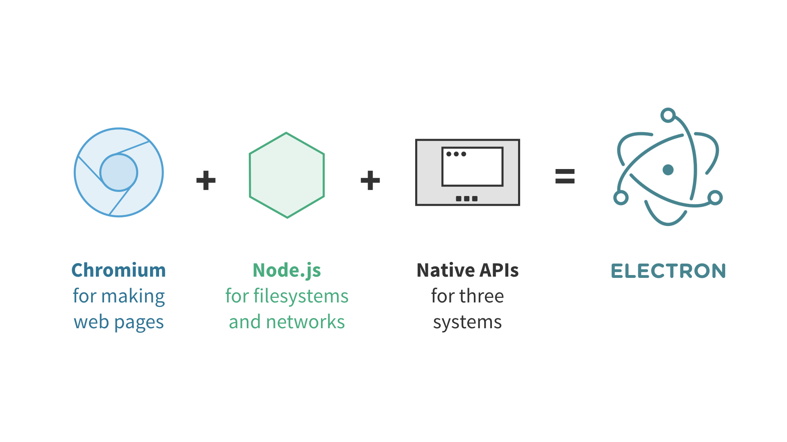
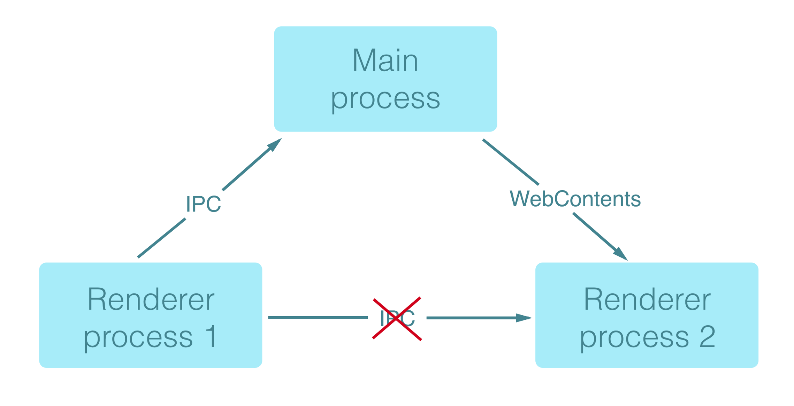
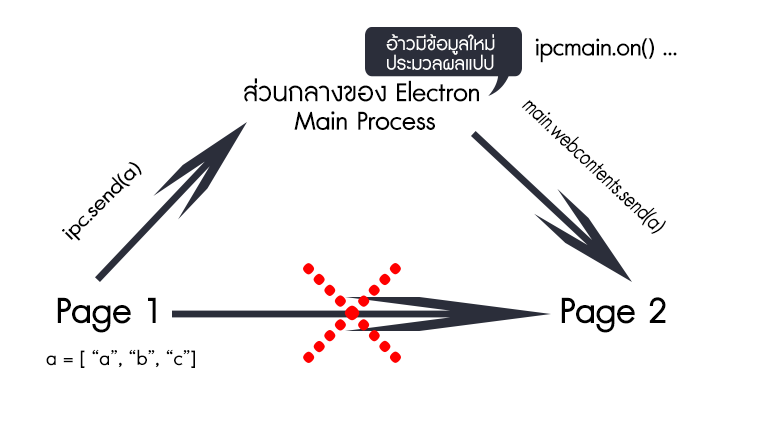

![[ประสบการณ์ ตอนที่ 1 ] มารู้จักกับ Electron กันเถอะ](./img/cover.png)

สวัสดีครับทุกคน ~ ต้อนรับกับ Content ใหม่ ที่ชื่อว่าประสบการณ์ ซึ่งชื่อมันดูไม่โก้เก๋เลยจริงๆ เพราะคิดไม่ออกว่าจะใช้ชื่ออะไรดี แต่ที่ตั้งชื่อนี้มาเพราะอยากจะเล่าประสบการณ์ที่ได้แตะ และได้สัมผัสมัน ก็ต้องบอกก่อนว่า บทความนี้มันค่อนข้าง Greek นิดนึง แต่จะพยายามเขียนให้อ่านง่ายที่สุดนะฮะ

#### เกริ่นนำ~
จริงๆแล้วอ่ะ ไม่ได้ตั้งใจจะลองไอ้เจ้าตัวนี้เลย แต่ว่า พอดีรับงาน Freelance ร่วมกับเพื่อนซึ่งเราตั้งชื่อกลุ่มว่า Andaman Studio Web Design & Development ซึ่งงานนี้เป็นงานแรกของกลุ่มที่ทำให้เรามีเงินเข้ามา ซึ่งลูกค้าเนี่ยเป็นหน่วยงานภาครัฐ เค้าต้องการโปรแกรมที่บันทึกข้อมูลแบบง่ายๆ แว้บแรกที่คิดเนี่ย เป็นเว็บแน่นอน ก็ตามชื่ออ่ะเนาะ ก็คือเราถนัดทำเว็บมากกว่า แต่เรื่องของเรื่องคือ เค้าต้องการเป็น Windows Application ผ่าง!!!

ทีนี้ทำไงดีหล่ะ เพราะ จะให้ไปเขียน C# ก็ไม่ค่อยถนัด แถมต้อง Research เยอะอีก เอาจริงๆเราก็เคยเขียน C# มาก่อนอ่ะ ตอนนั้นทำ Project ให้เพื่อน คือไม่ได้ตั้งใจจะเรียน แต่ต้องเรียนเพราะเพื่อนต้องมีงานส่ง … แต่ถ้าเขียน C# แล้วเพื่อนจะเขียนได้มั้ย เพราะส่วนใหญ่ของทีมเราถนัดเป็น เว็บ เราก็เลยเลือกที่จะทำเว็บ

ซึ่งเอาจริงๆเคยอ่านบทความ Electron เมื่อสองปีก่อน ตอนที่มันออกมาใหม่ๆเมื่อปี 2017 และจำได้ว่า มันเอา Javascript ไปเขียนเป็น Windows app ได้ ซึ่งมัน Cross Platform ตามที่เคยอ่านมาว่า แค่เขียน JS มันเอาไป Build ใช้ บน windows , linux , mac ได้หมด ทีนี้ เราเลยอยากมาลองเขียนแชร์ประสบการณ์เล็กๆ เผื่อใครผ่านมาผ่านไปมาเห็น ก็จะได้ไปลองเล่นๆกันอ่ะเนอะ
เริ่ม~

#### เริ่ม~

ไอ้เจ้า electron เนี่ยมันถูกพัฒนาโดย github ซึ่งมันทำให้ช่วย ทำ Application GUI บน OS ที่ใช้เทคโนโลยีเว็บ ซึ่งถ้าเขียนเว็บเป็น แค่อ่าน Electron นิดหน่อย ก็สามารถทำงานได้แล้วแหละ
ซึ่งมันก็มีหลายๆ App ที่ถูกพัฒนาด้วยเจ้า Electron ก็พวก VSCode , Atom , Slack , Postman และอีกหลากหลาย ที่เรารู้จักกันถมเถ ไป

#### Concept~

เจ้า Electron เนี่ยมันทำงานบน NodeJS ซึ่ง สามารถใช้ npm package ในการติดตั้งได้เหมือนกัน และก็มัน ถูกครอบด้วย Chromium Environment ซะด้วยนะ เท่าที่ลองใช้ มันสามารถ Inspect ได้เหมือน google chrome ที่เราใช้ด้วยแหละ ซึ่งแทบไม่ต้องศึกษาการทำ UI เลย ทำเว็บเป็นก็ทำ App บน OS เป็นอ่ะะเจ๋งเฟร่อ

มาดูเรื่องโครงสร้างกันเถอะ เราจะเห็นว่า Electron มันถูกครอบด้วย Chromium

ซึ่งถ้าเราดูจากภาพ ให้เรานึกเป็นภาพใหญ่ว่า มี Chromium ซ้อนอยู่ นะฮะ แล้วส่วนประกอบภายในของ electron การทำงานของมันจะมีสองอย่าง
1. Main Process เจ้าตัวนี้ จากประสบการณ์การลองมา แล้ว มันคือไฟล์กลางที่จะคอยควบคุม Renderer Process ทุกๆอันที่ใส่เข้าไป และใช้ Render Windows ที่มีไฟล์ที่เรารันอยู่ข้างในด้วย ทำให้เราได้อีกหน้าต่างนึง อารมณ์เหมือน C# เลยที่มีหลายๆหน้าต่าง
2. Renderer Process คือหน้าเว็บที่เป็นไฟล์ html เนี่ยแหละ หรืออาจจะเป็นไฟล์อื่นๆก็ได้ที่มันสามารถ Render มาเป็นเว็บได้

และการติดต่อสื่อสารระหว่าง Main Process กับ Renderer Process ก็ตามภาพบนอ่ะครับ หยอกๆ ก็คือ ถ้าเป็น Renderer Process อย่างสมมุติผมต้องการจะส่ง Array ซักก้อนไปยัง Page2 จาก Page 1 เราจะไม่สามารถส่งจาก Page 1 ไป Page 2 โดยตรงนะครับ จะต้องทำผ่านศูนย์กลางเท่านั้นซึ่งก็คือ Main Process นั่นเองจ้า เดิ๋ยววาดภาพให้ดู

จะเห็นว่ากระบวนการส่ง Array มันข้ามไป Page2 ไม่ได้ ต้องไปเริ่มที่ Main process แล้วเราก็ไปเขียน ให้ main process เป็นคนส่งไป นั่นเอง ~

#### อยากลองเล่นทำไง~

จริงๆตอนแรกที่ศึกษาก็ไป clone โปรเจคชาวบ้านมาลองเล่นนะ และก็ยัง งงๆ ก็เลยไปซื้อ Course ใน Udemy มาลอง ดูดิ๊ ลงทุนขนาดไหนอ่ะ เพราะต้องส่งงานให้ลูกค้า เดิ๋ยวไม่มีงาน แต่ถ้าใครอยากลองเล่นก็ มันมี 
Quick Start ให้ลองเล่นนะ

Link => https://github.com/electron/electron-quick-start

ถ้าเราโคลนลงมา ก็จะมี Stucture ตามใน git และถ้ายอยากรู้ว่าเจ้า Main Process อยุ่ตรงไหน ให้ไปเล่นที่ไฟล์ Main.js เลยจ้า

`gist:topspinppy/0d99a51d045022dd2efb9e57c49a9bde#file-example-sh-L10`
